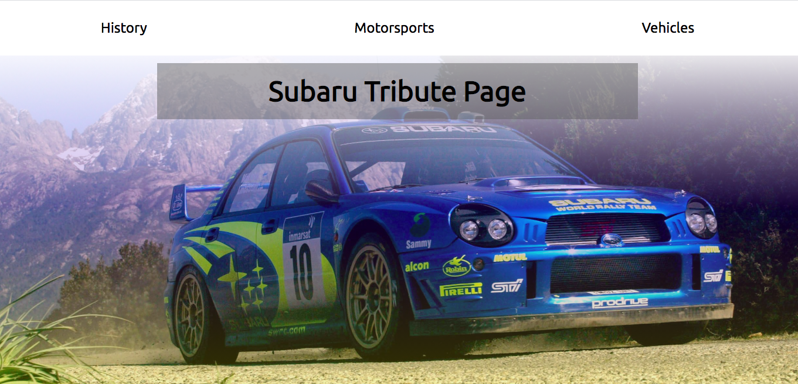
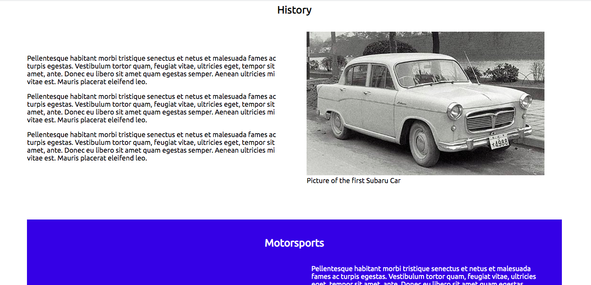
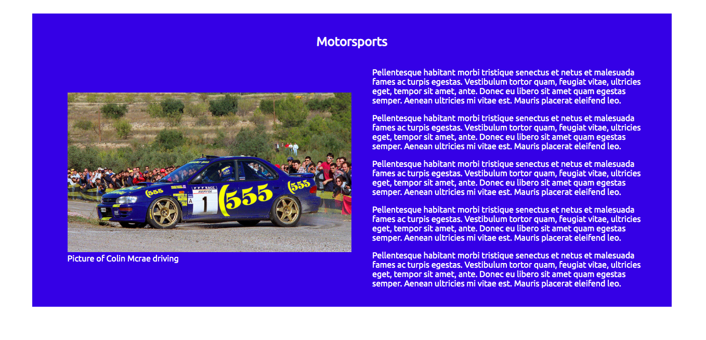

# HTML and CSS Projects

This repository contains a portfolio of my HTML and CSS projects.

## Contents

   * [Tribute Page](#Tribute-Page)
     * Front-End Design
   * [Technical Documentation Page](#Technical-Documentation-Page)
     * Front-End Design
   * [Product Landing Page](#Product-Landing-Page)
     * Front-End Design
   * [Survey Form](#Survey-Form)
     * Front-End Design
   * [Author(s)](#Author(s))
   
 ## Tribute Page

This is a mock tribute page to the car manufacturer Subaru.
To get this page to run properly you'll need all of the contents of the "Tribute_page" directory. 
Make sure you don't take any of the files out of their respected directories as this will ruin the HTML links.
Now that you have all the directories and files, open the "index.html" file located in "Tribute_page/HTML/" directory and the page will run.

### Front-End Design

#### Tribute Page Header

#### Tribute Page Body

## Technical Documentation Page

This is a mock technical documentation page. 
To get this page to run properly you'll need all of the contents of the "Technical_Documentation_page" directory. 
Make sure you don't take any of the files out of their respected directories as this will ruin the HTML links.
Now that you have all the directories and files, open the "index.html" file located in "Technical_Documentation_page/HTML/" directory and the page will run.

### Front-End Design

## Product Landing Page

This is a mock product landing page for an artist advertising their galleries and selling artwork.
To get this page to run properly you'll need all of the contents of the "product_landing_page" directory. 
Make sure you don't take any of the files out of their respected directories as this will ruin the HTML links.
Now that you have all the directories and files, open the "index.html" file located in "product_landing_page/HTML/" directory and the page will run.

### Front-End Design

## Survey Form

This is a mock survey form to allow a user to leave feedback on my portfolio. 
To get this page to run properly you'll need all of the contents of the "survey_form" directory. 
Make sure you don't take any of the files out of their respected directories as this will ruin the HTML links.
Now that you have all the directories and files, open the "index.html" file located in "survey_form/HTML/" directory and the page will run.

### Front-End Design

## Author(s)

Reece Smith
